This lab is for applying the knowledge of data cleaning and visualization to real-world dataset, and gain hands-on experience of data processing from it.

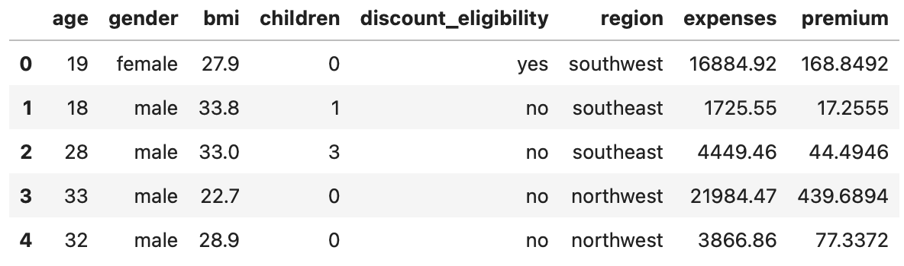
Here are some data in the dataset.

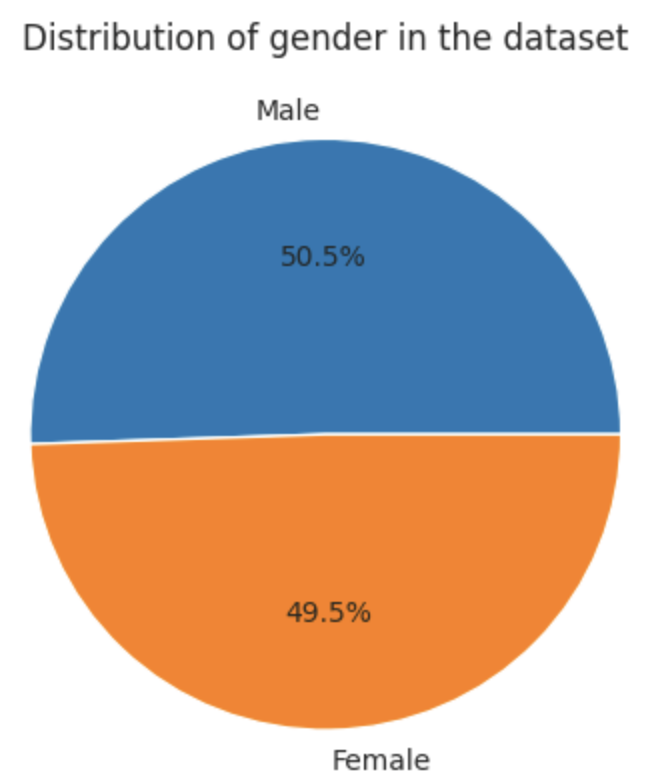
I plotted a pie chart of each gender in the dataset, and the result is quite uniform (50.5% male and 49.5% female).
It indicates that the dataset is not biased towards any gender, so statistical results are less likely to favor a gender over another one.

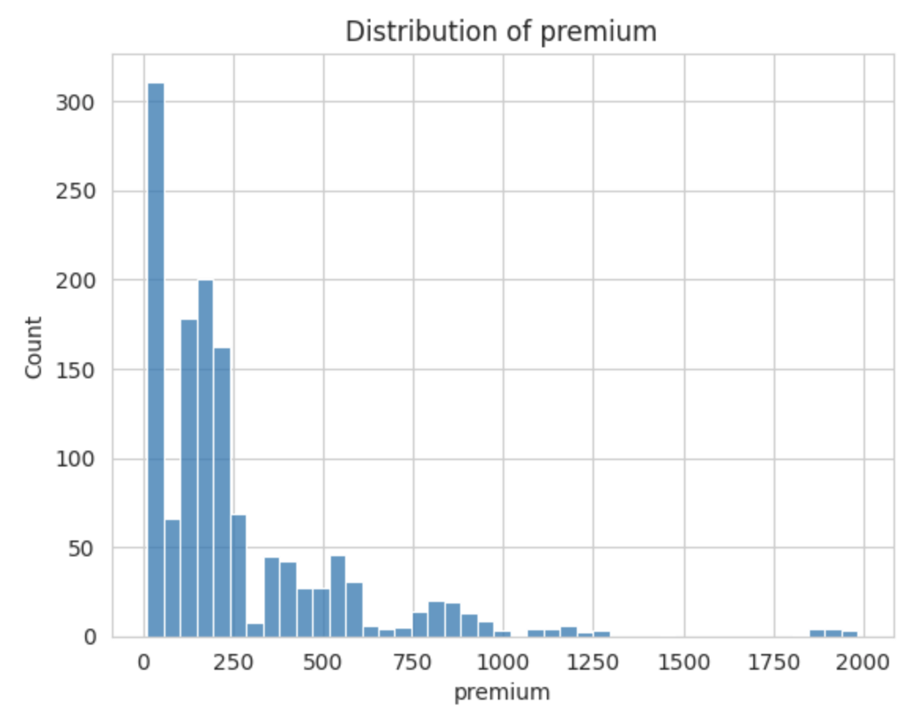
I also plotted a histogram of the premium to show its distribution.
From the plot, it can be seen that there are some extreme values.
Those values should be accounted in the data cleaning steps later, so that they will not introduce noise to the analysis results.

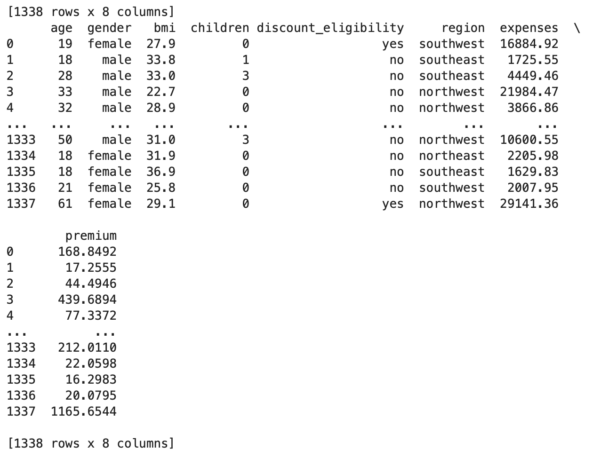
As the dataset contains no missing value, it looks the same before and after dropping rows with missing values.
I included the code anyway for completeness.

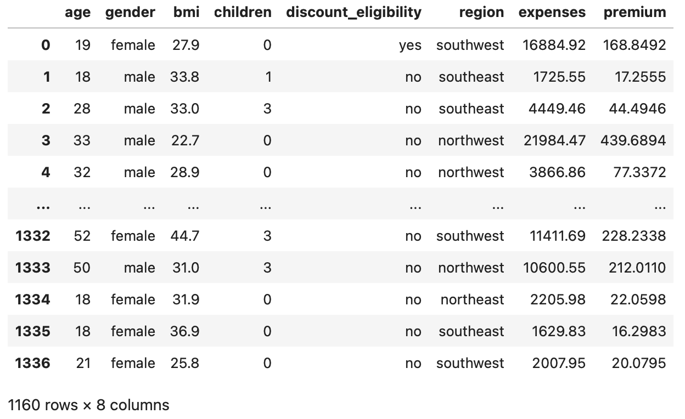
I used IQR for identifying and removing outliers.
It can be seen that the number of rows reduced after removing outliers.

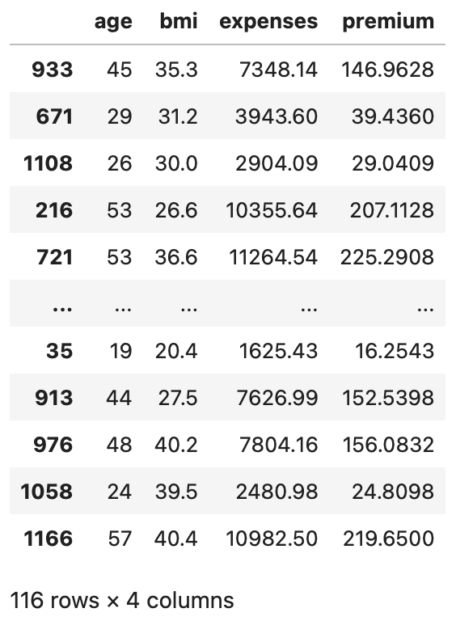
I removed all rows other than age, bmi, expenses, and premium.

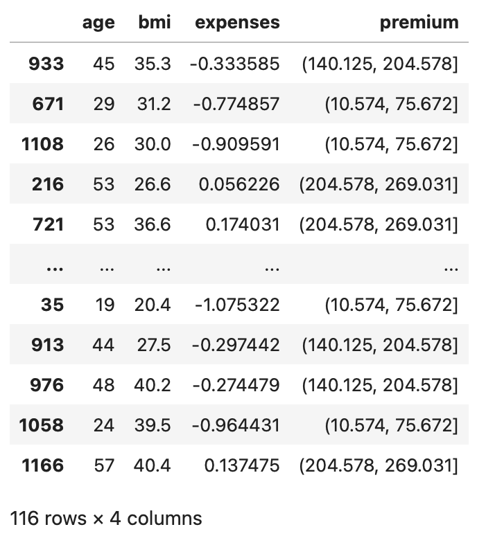
I normalized expenses with z-scoring, and binned premium into 10 bins.

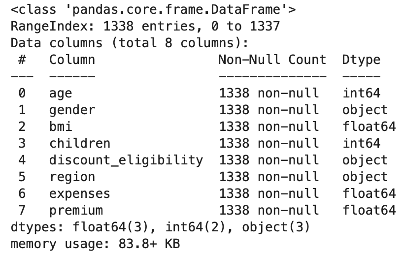
`.info` shows columns and data type of each column, etc.

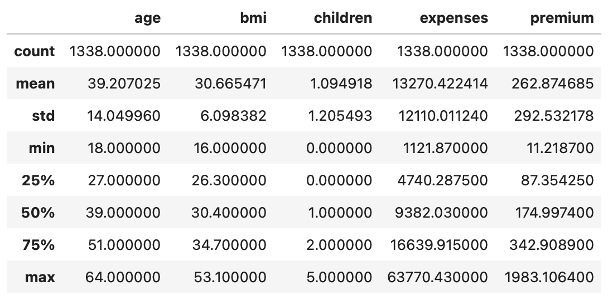
`.describe` shows basic statistics of numerical columns.

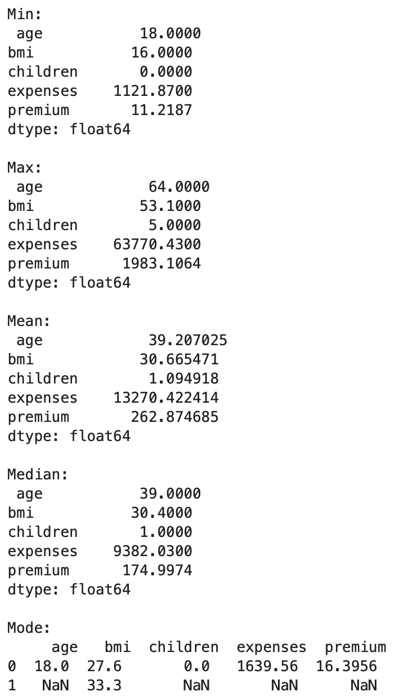
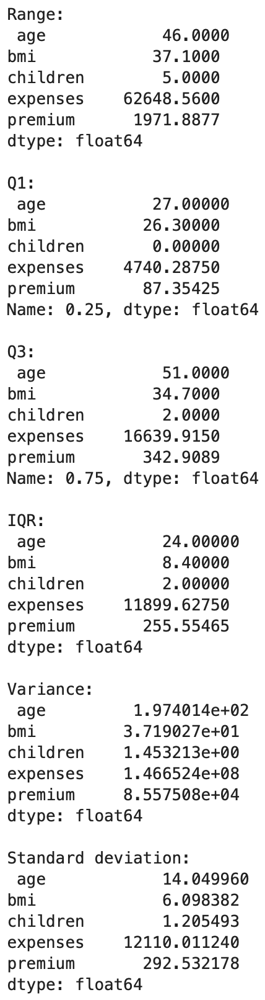
Central tendency and dispersion measures of each numerical columns.

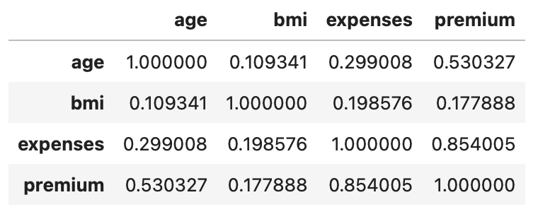
Correlation matrix of each numerical columns.

From the dataset and statistics, it can be seen that expenses varies a lot more than premium.
Premium is right-skewed, it has strong correlation with expenses, and less correlation with age, and even lesser correlation with bmi.

Here are some challenges as I'm finishing the assignment.

When I first draw the pie chart of gender composition, I wrote `plt.pie(df['gender'], labels=df['gender'])`, and the code failed with `ValueError: could not convert string to float: 'female'`.
After some research, I found out I'm actually instructing matplotlib to plot all of the strings in `df['gender']`, which is not realistic and not what I'm trying to do.
I changed the code to
```python
male_count = len(df[df['gender'] == 'male'])
female_count = len(df[df['gender'] == 'female'])
plt.pie([male_count, female_count], labels=['Male', 'Female'])
```
To be honest, I don't think the code is very elegant, but it can get the work done.
I also found by plotting the pie chart this way, the pie chart would not show the percentage of each item (Male and Female in this case) in it. 
After reading the documentation, I found the `autopct` parameter, and added `autopct='%1.1f%%'` to `plt.pie`.
Now the pie chart shows both an intuitive plot for the diagram, and an exact percentage for reference, which provides another option for the reader, thus better.

When I was sampling data, I first wrote `df_sampled = df2.sample(frac=0.1)`.
It works, and I can draw some conclusions with the sampled data.
However, when I rerun the notebook, the sampled rows changed, and I have to analyze the data again.
This is not robostic enough, so I was looking for a repeative way to sample rows.
Luckily, there's an option for the `sample` function: `random_state`.
If I set this parameter to a constant value, then every time I ran the notebook, the same rows are selected, so my analysis remains valid.